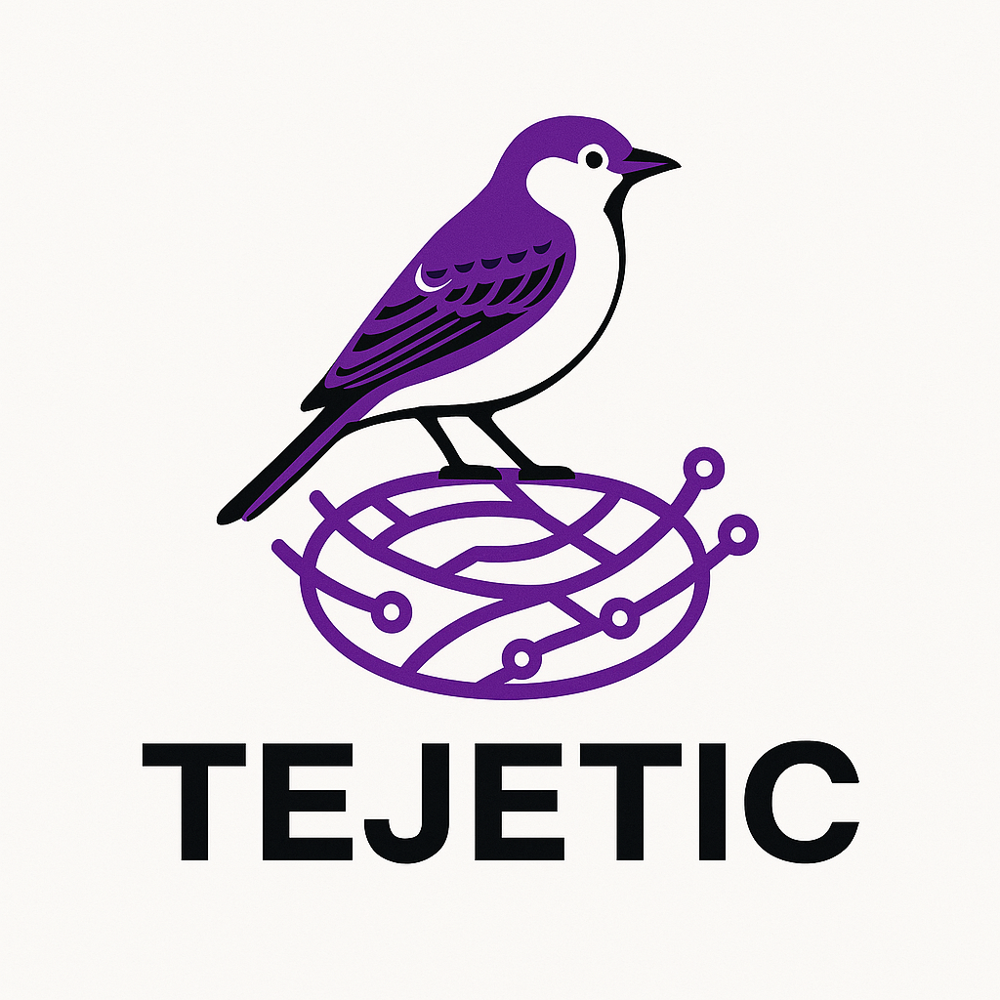

## TejeTic

Se realiza API CRUD en el  framework laravel 10 y Postgres las instrucciones de despliegue son las siguientes:

- Clonar el repositorio (https://github.com/sebasbeltran95/CRUD-API-Postgres-TejeTic.git).
- Descomprimir los archivos vendor.rar y .rar.
- Realizar un composer update.
- Ejecutar la migracion (php artisan migrate).

## Documentacion

Endpoint GET http://localhost:8000/api/get_his, muestra todos los registros

Respuesta
{
    "success": true,
    "data": [
        {
            "id": 1,
            "nombre_completo": "pepito",
            "edad": 18,
            "created_at": "2025-04-26T16:21:08.000000Z",
            "updated_at": "2025-04-26T16:54:02.000000Z"
        },
        {
            "id": 3,
            "nombre_completo": "pepitoo",
            "edad": 12,
            "created_at": "2025-04-26T17:30:35.000000Z",
            "updated_at": "2025-04-26T17:30:35.000000Z"
        }
    ]
}

Endpoint POST http://localhost:8000/api/search_his, consultar por registro

{
    "id":1
}

Respuesta
{
    "success": true,
    "data": [
        {
            "id": 1,
            "nombre_completo": "pepito",
            "edad": 18,
            "created_at": "2025-04-26T16:21:08.000000Z",
            "updated_at": "2025-04-26T16:54:02.000000Z"
        }
    ]
}

Endpoint POST http://localhost:8000/api/post_his, insertar registros
[
    {
        "nombre_completo": "pepitoo",
        "edad": 12
    }
]

Respuesta
[
    {
        "nombre_completo": "pepitoo",
        "edad": 12,
        "updated_at": "2025-04-26T17:30:35.000000Z",
        "created_at": "2025-04-26T17:30:35.000000Z",
        "id": 3
    }
]

Endpoint PUT http://localhost:8000/api/update_his, actualizar registros
[
    {
        "id": 1,
        "nombre_completo": "pepito",
        "edad": 18
    }
]

Respuesta
[
    {
        "id": 1,
        "nombre_completo": "pepito",
        "edad": 18,
        "created_at": "2025-04-26T16:21:08.000000Z",
        "updated_at": "2025-04-26T16:54:02.000000Z"
    }
]

Endpoint PUT http://localhost:8000/api/delete_his, eliminar registro
{
    "id": 2
}

## License

The Laravel framework is open-sourced software licensed under the [MIT license](https://opensource.org/licenses/MIT).
